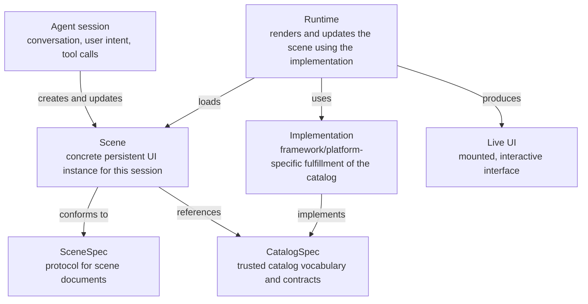

# CatalogSpec

CatalogSpec is a contract model for agent-created UI scenes: persistent, structured interfaces that live alongside a conversation and evolve as the session evolves.

The goal is to let an AI agent create and update UI by speaking JSON, without generating framework-specific code. The JSON stays bounded by strict contracts. Implementations stay decoupled and trusted.

## Vision

Agents should be able to create a scene for a conversation, keep that scene alive across turns, and update it as the conversation changes.

That requires a shared language between three things:

- the **agent**, which creates and updates the scene
- the **catalog**, which defines what the agent is allowed to use
- the **implementation**, which renders and executes the scene in a real runtime

CatalogSpec is the contract layer that keeps those pieces coherent.

## Architecture

GitHub supports Mermaid diagrams in Markdown, so the architecture can be shown directly in this README.



Short version:

```txt
CatalogSpec defines what a scene may reference.
SceneSpec defines the protocol for scene documents.
A scene is the concrete session instance an agent creates and updates.
Implementation fulfills the catalog for a platform/framework.
Runtime renders and updates the scene using that implementation.
```

The runtime is not the contract, the scene, or the implementation. It is the layer that takes a concrete scene and an available implementation, then produces a live, updateable UI.

## Current status

- **CatalogSpec** is active, schema-backed, and validated by the CLI. It defines catalog, domain, item, theme, action, event, and requirements contracts.
- **SceneSpec** is draft. It currently defines a scene snapshot model for concrete persisted scenes, but there is no canonical SceneSpec JSON Schema or validator yet.
- **Runtime and implementation** are draft vocabulary only. Runtime APIs, implementation manifests, action dispatch, event routing, and state ownership are intentionally not locked.

## Layers

### CatalogSpec

Status: Active

CatalogSpec defines the language bridge between agent-authored scenes and framework-specific implementations.

A catalog describes a domain's available UI items, shared state shape, theme contract, actions, events, and behavioral requirements. It does not prescribe React, SwiftUI, Flutter, HTML, or any other target.

See [CatalogSpec](./docs/catalog-spec.md).

### SceneSpec

Status: Draft

SceneSpec defines the protocol for concrete scene documents. A scene is the UI instance an agent has created for a particular conversation or session.

See [SceneSpec](./docs/scene-spec.md).

### Implementations

Status: Draft

An implementation fulfills a catalog for a specific framework or platform. For example, a React implementation of a commerce catalog would provide React components for the catalog's items.

### Runtime

Status: Draft

A runtime renders and maintains a concrete scene using an available implementation of the referenced catalog. It validates scene data, provides state/theme/actions, mounts rendered items, applies updates, and routes events.

See [Runtime model](./docs/runtime-model.md).

## Current repository contents

```txt
/docs                  specification and design docs
/schemas               JSON Schemas for the active CatalogSpec layer
/examples/commerce     reference catalog example
/cli                   validation CLI for catalog conformance
```

The schemas currently support CatalogSpec catalog validation. They do not include a canonical SceneSpec schema yet.

This repository is not a central catalog registry. Reference catalogs live under `/examples`; downstream projects commonly keep their own catalogs under `/catalogs/[catalogId]/`.

Framework/runtime code should normally live downstream. If experimental runtime code is included here, it should live under an explicitly non-normative examples path such as `/examples/runtimes/...` and should not define conformance behavior.

## Validation CLI

```bash
cd cli
npm install
npm run build
node dist/cli.js validate ../examples/commerce
```

Agent-friendly JSON output:

```bash
node dist/cli.js validate ../examples/commerce --json
```

## Start here

- [CatalogSpec](./docs/catalog-spec.md)
- [SceneSpec](./docs/scene-spec.md)
- [Runtime model](./docs/runtime-model.md)
- [Glossary](./docs/glossary.md)
- [Architecture decision records](./docs/adrs/README.md)
