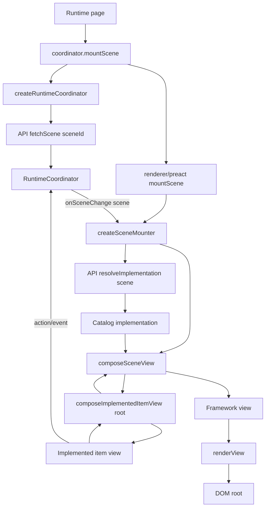
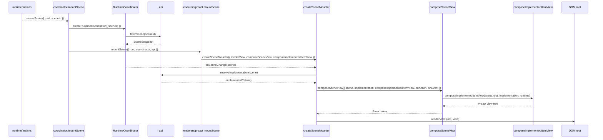

# Renderers

Status: experimental / non-normative

A renderer adapts scene data and catalog implementations to a native UI framework such as Preact, React, Lit, or another target.

The renderer contract uses two important words:

- **compose**: turn scene/item runtime input into a framework-specific view value, such as Preact `ComponentChild`, React `ReactNode`, or Lit `TemplateResult`.
- **render**: commit that framework-specific view value into a host target, such as a DOM element.

In other words, `compose*View` builds the view tree; `renderView` mounts/updates it.

In this experiment, the renderer layer is separate from:

- `src/coordinator/` — scene orchestration, host/runtime messaging, and scene lifecycle
- `src/api/` — local API client shim for scenes and implementations
- `implementations/` — catalog-specific component implementations

## Current shape

```txt
renderers/
  createSceneMounter.ts   # shared factory for renderer-specific mounters
  index.ts
  preact/
    index.ts
    src/
      mountScene.tsx                 # Preact mounter created from createSceneMounter
      composeSceneView.tsx           # scene -> Preact view value
      composeImplementedItemView.tsx # scene item instance -> implemented item input -> Preact view value
```

## Stateful item model scaffold

`models/` contains an experimental item model scaffold inspired by the sibling ProxyModel project. It lets an implemented item separate model/state/actions from view rendering:

```ts
export const model = {
  actions: state => ({
    increment() {
      state.count += 1;
    },
  }),
} satisfies Model;

export const Counter = {
  model,
  view,
} satisfies Item;
```

Initial/current state is supplied by the scene/runtime item instance, not by the implemented item view. `composeImplementedItemView` is the adapter that creates/looks up the item model from that state, passes readonly model state and bound actions into the view, emits state transitions, and requests a renderer update. This is intentionally early scaffolding for framework-independent state/action handling and debug tooling.

## Responsibility split

### `createSceneMounter`

Shared renderer utility. It wires together:

- the runtime coordinator
- the API client
- a renderer-specific `composeSceneView`
- a renderer-specific `composeImplementedItemView`
- a renderer-specific `renderView`

Together these form the framework-specific renderer contract.

It does not know Preact, React, Lit, or any specific catalog.

### `composeSceneView`

Framework-specific scene view composer.

It receives:

- the scene snapshot
- the resolved catalog implementation
- `composeImplementedItemView`
- action/event handlers from the runtime coordinator

It returns the framework view value for the whole scene without committing it to the DOM.

### `composeImplementedItemView`

Framework-specific item view composer.

It receives one scene item instance, finds the matching implemented item in the catalog implementation, composes slots recursively, binds model state/actions to the item view, and returns the framework view value for that item.

### `renderView`

Framework/native mount primitive.

For Preact this is effectively:

```ts
render(view, root);
```

It takes the framework view value returned by `composeSceneView` and commits it into the DOM root.

## Flow



## Preact flow



## Naming note

Exports inside a renderer are intentionally framework-local:

```ts
import { mountScene, composeSceneView, composeImplementedItemView } from "../../renderers/preact";
```

The import path already identifies the framework, so exported names do not include `Preact`.
