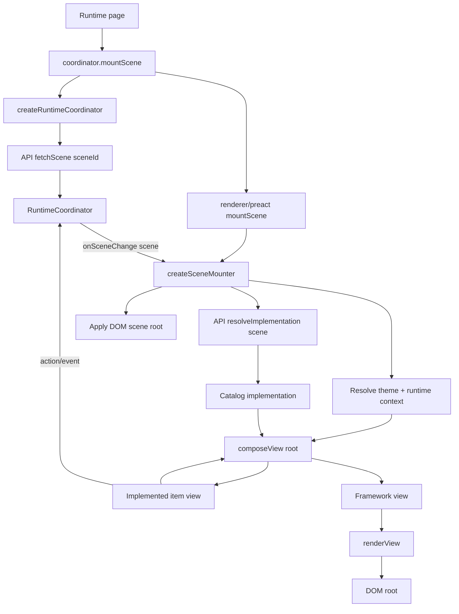
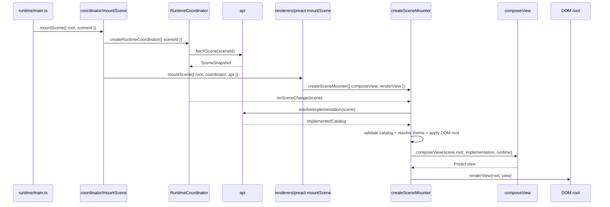

# Renderers

Status: experimental / non-normative

A renderer adapts scene data and catalog implementations to a native UI framework such as Preact, React, Lit, or another target.

The web experiment separates two layers:

- **web/environment layer**: owns DOM root setup, scene fetching, implementation resolution, catalog/theme checks, and runtime context construction.
- **view renderer layer**: owns only framework-specific view composition and committing that view to the host.

The renderer contract uses two important words:

- **compose**: turn a scene item instance plus runtime/model input into a framework-specific view value, such as Preact `ComponentChild`, React `ReactNode`, or Lit `TemplateResult`.
- **render**: commit that framework-specific view value into a host target, such as a DOM element.

In other words, `composeView` builds the framework view tree; `renderView` mounts/updates it.

## Current shape

```txt
renderers/
  createSceneMounter.ts   # shared web/environment mounter factory
  implementedItem.ts
  types.ts
  index.ts
  preact/
    index.ts
    src/
      mountScene.tsx      # Preact mounter created from createSceneMounter
      composeView.tsx     # scene item instance -> implemented item input -> Preact view value
```

## Stateful item model scaffold

`models/` contains an experimental item model scaffold inspired by the sibling ProxyModel project. It lets an implemented item separate model/state/actions from view rendering:

```ts
export const model = {
  actions: state => ({
    increment() {
      state.count += 1;
    },
  }),
} satisfies Model;

export const Counter = {
  model,
  view,
} satisfies Item;
```

Initial/current state is supplied by the scene/runtime item instance, not by the implemented item view. `composeView` is the adapter that creates/looks up the item model from that state, passes readonly model state and bound actions into the view, emits state transitions, and requests a renderer update. This is intentionally early scaffolding for framework-independent state/action handling and debug tooling.

## Responsibility split

### `createSceneMounter`

Shared web/environment utility. It wires together:

- the runtime coordinator
- the API client
- implementation resolution
- catalog/version matching
- theme resolution
- renderer runtime context construction
- DOM scene root styling
- a renderer-specific `composeView`
- a renderer-specific `renderView`

It does not know Preact, React, Lit, or any specific catalog.

### `composeView`

Framework-specific item/tree view composer.

It receives one scene item instance, finds the matching implemented item in the catalog implementation, composes slots recursively, binds model state/actions to the item view, and returns the framework view value for that item tree.

### `renderView`

Framework/native mount primitive.

For Preact this is effectively:

```ts
render(view, root);
```

It takes the framework view value returned by `composeView` and commits it into the DOM root.

## Flow



## Preact flow



## Naming note

Exports inside a renderer are intentionally framework-local:

```ts
import { mountScene, composeView } from "../../renderers/preact";
```

The import path already identifies the framework, so exported names do not include `Preact`.
