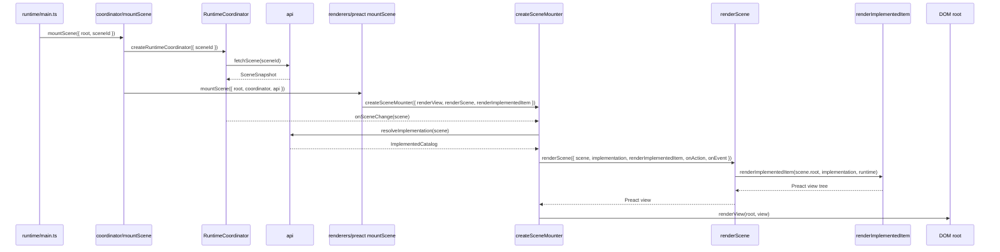

# Renderers

Status: experimental / non-normative

A renderer adapts scene data and catalog implementations to a native UI framework such as Preact, React, Lit, or another target.

In this experiment, the renderer layer is separate from:

- `src/coordinator/` — scene orchestration, host/runtime messaging, and scene lifecycle
- `src/api/` — local API client shim for scenes and implementations
- `implementations/` — catalog-specific component implementations

## Current shape

```txt
renderers/
  createSceneMounter.ts   # shared factory for renderer-specific mounters
  index.ts
  preact/
    index.ts
    src/
      mountScene.tsx      # Preact mounter created from createSceneMounter
      renderScene.tsx     # scene -> Preact view
      renderImplementedItem.tsx      # scene item instance -> implemented item input -> Preact view
```

## Stateful item model scaffold

`models/` contains an experimental item model scaffold inspired by the sibling ProxyModel project. It lets an implemented item separate model/state/actions from view rendering:

```ts
export const counterModel = defineItemModel({
  actions: state => ({
    increment() {
      state.count += 1;
    },
  }),
});

export const Counter = defineImplementedItem({
  model: counterModel,
  view({ state, actions }) {
    return /* framework view */;
  },
});
```

Initial/current state is supplied by the scene/runtime item instance, not by the implemented item view. `renderImplementedItem` is the adapter that creates/looks up the item model from that state, passes readonly model state and bound actions into the view, emits state transitions, and requests a renderer update. This is intentionally early scaffolding for framework-independent state/action handling and debug tooling.

## Responsibility split

### `createSceneMounter`

Shared renderer utility. It wires together:

- the runtime coordinator
- the API client
- a renderer-specific `renderScene`
- a renderer-specific `renderImplementedItem`
- a renderer-specific `renderView`

It does not know Preact, React, Lit, or any specific catalog.

### `renderView`

Framework/native mount primitive.

For Preact this is effectively:

```ts
render(view, root);
```

It takes the framework view returned by `renderScene` and commits it into the DOM root.

### `renderScene`

Framework-specific scene renderer.

It receives:

- the scene snapshot
- the resolved catalog implementation
- `renderImplementedItem`
- action/event handlers from the runtime coordinator

It returns the framework view for the whole scene.

### `renderImplementedItem`

Framework-specific item renderer.

It receives one scene item instance, finds the matching component in the catalog implementation, renders slots recursively, and returns the framework view for that item.

## Flow


## Preact flow



## Naming note

Exports inside a renderer are intentionally framework-local:

```ts
import { mountScene, renderScene, renderImplementedItem } from "../../renderers/preact";
```

The import path already identifies the framework, so exported names do not include `Preact`.
