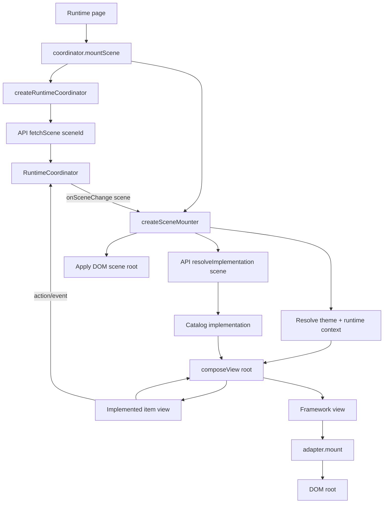
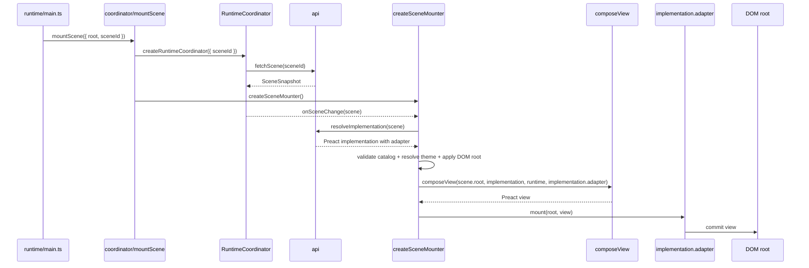

# Renderers

Status: experimental / non-normative

The shared renderer utilities adapt scene data and catalog implementations to a framework-native view value, such as Preact children, React nodes, Lit templates, or another web view target.

The web experiment separates two layers:

- **web/environment layer**: owns DOM root setup, scene fetching, implementation resolution, catalog/theme checks, and runtime context construction.
- **view adapter layer**: supplied by each implementation; owns only framework-specific boundary creation and host mounting.

The required implementation-provided view adapter has two framework-specific primitives:

- **boundary**: create an embeddable framework-native view boundary, such as a Preact child, React node, or Lit template fragment.
- **mount**: commit a completed framework-native view value into a host target, such as a DOM element.

The shared `composeView` function now owns scene traversal, model binding, lifecycle binding, and slot outlet creation by using the adapter's `boundary` primitive. The adapter's `mount` primitive only commits the final view to the host.

## Current shape

```txt
renderers/
  composeView.ts          # shared renderer-agnostic scene item composer
  createSceneMounter.ts   # shared web/environment mounter factory
  implementedItem.ts
  types.ts
  index.ts

implementations/preact/splash/src/
  adapter.tsx             # Preact boundary + mount primitives supplied by the implementation
```

## Stateful item model scaffold

`models/` contains an experimental item model scaffold inspired by the sibling ProxyModel project. It lets an implemented item separate model/state/actions from view rendering:

```ts
export const model = {
  actions: state => ({
    increment() {
      state.count += 1;
    },
  }),
} satisfies Model;

export const implemented = {
  model,
  lifecycle,
  view,
} satisfies Item<ComponentChildren>;
```

Implementations may also provide shared contexts next to items:

```txt
contexts/
  scene/   # scene/domain state + actions
  theme/   # active theme state + actions
items/
```

Item views receive these through `context`, for example `context.scene.actions.login(...)` or `context.theme.actions.setTheme(...)`.

Items provide a lifecycle file for runtime-driven orchestration. Individual lifecycle hooks are optional; an empty lifecycle object is a no-op:

```ts
export const lifecycle = {} satisfies Lifecycle;

// Or, for runtime tick behavior:
export const lifecycle = {
  tick({ actions }, frame) {
    actions.advance({ deltaMs: frame.deltaMs });
  },
} satisfies Lifecycle;

export const implemented = {
  model,
  lifecycle,
  view,
} satisfies Item<ComponentChildren>;
```

Initial/current item state is supplied by the scene/runtime item instance, not by the implemented item view. Shared runtime capabilities are supplied through typed implementation contexts, such as `context.scene.state/actions` and `context.theme.state/actions`. Shared `composeView` creates/looks up item models, passes readonly model state, bound actions, slots, and context into item views, calls optional model lifecycle hooks, emits state transitions, and requests a renderer update. This is intentionally early scaffolding for framework-independent state/action/lifecycle/context handling and debug tooling.

## Responsibility split

### `createSceneMounter`

Shared web/environment utility. It wires together:

- the runtime coordinator
- the API client
- implementation resolution
- catalog/version matching
- theme resolution
- implementation context model creation from scene/theme inputs
- renderer runtime context construction
- model lifecycle tracking and one shared ticker
- DOM scene root styling
- the shared `composeView`
- the implementation-provided view adapter with `boundary` and `mount` primitives

It does not know Preact, React, Lit, or any specific catalog. The implementation resolved by the API brings its own adapter.

### `composeView`

Shared item/tree view composer.

It receives one scene item instance, finds the matching implemented item in the catalog implementation, creates slot outlets through the framework adapter, binds model state/actions and typed runtime context to the item view, registers optional lifecycle hooks, and returns the framework view value for that item boundary.

Slots are represented generically as renderer-specific outlet values, not arrays of already-composed child view values. Item contracts may narrow the slot object by name:

```ts
type DefaultSlots<TView> = Record<string, TView | undefined>;

type ModalSlots<TView> = {
  content?: TView;
};
```

A Preact view can render those outlets directly, while other renderers can project them into their own native boundary primitive. This keeps slot names catalog-derived while leaving the concrete outlet value generic over each renderer.

### Implementation view adapter

Framework/native boundary and mount primitives supplied on the resolved implementation.

For Preact this is effectively:

```tsx
boundary({ key, render }) {
  return <Boundary key={key} render={render} />;
}

mount(root, view) {
  render(view, root);
}
```

`boundary` creates an embeddable view value for slots and future item boundaries. `mount` takes the framework view value returned by `composeView` and commits it into the DOM root.

## Flow



## Preact flow



Implementations are BYO-adapter: as long as item views and `adapter` agree on `TView`, the shared mounter/composer handles the rest.
